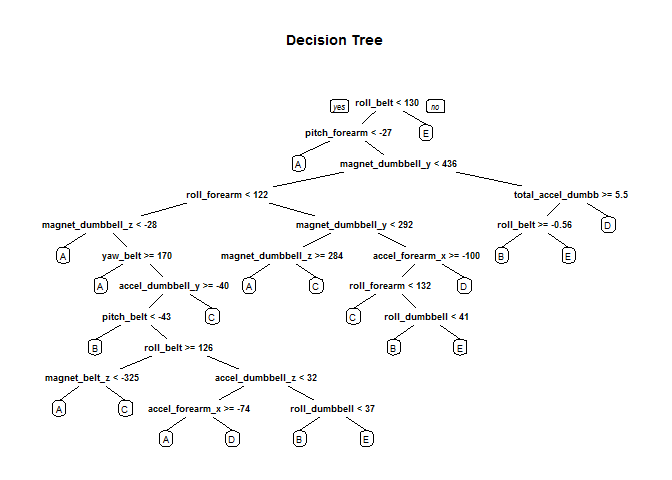

# Coursera Data Science Class #8, Practical Machine Learning
Practical Machine Learning: Course Project; Robert Ross; 2015.05.24

## Summary
This project allows us to take both training and test data from a study using accelerometers placed on the belt, forearm, arm, and dumbells used by 6 participants who were asked to perform barbell lifts correctly and incorrectly in 5 different ways. The website at  http://groupware.les.inf.puc-rio.br/har contains more information for the study by:

*Velloso, E.; Bulling, A.; Gellersen, H.; Ugulino, W.; Fuks, H. Qualitative Activity Recognition of Weight Lifting Exercises. Proceedings of 4th International Conference in Cooperation with SIGCHI (Augmented Human '13) . Stuttgart, Germany: ACM SIGCHI, 2013.*

We are trying, per Professor Leek's instructions, to "predict the manner in which they did the exercise." 
The 5 possible methods are:

- A: exactly according to the specification
- B: throwing the elbows to the front
- C: lifting the dumbbell only halfway
- D: lowering the dumbbell only halfway
- E: throwing the hips to the front
  
  
  
## Setup and Data Processing
  
  
If we haven't retrieved the files yet (first time), download and save them, then load them into memory.

```r
setwd("~/Coursera/8-Practical Machine Learning/Course Project/")
if (!file.exists("./data/pml-training.csv")){
    download.file("https://d396qusza40orc.cloudfront.net/predmachlearn/pml-training.csv",
                  "./data/pml-training.csv")
    }
if (!file.exists("./data/pml-testing.csv")){
    download.file("https://d396qusza40orc.cloudfront.net/predmachlearn/pml-testing.csv",
                  "./data/pml-testing.csv")
    }
data_training_raw = read.csv("./data/pml-training.csv", na.strings = c("NA", ""))
data_testing_raw  = read.csv("./data/pml-testing.csv", na.strings = c("NA", ""))
library(caret)
```

```
## Loading required package: lattice
## Loading required package: ggplot2
```

```r
library(rpart)
library(rpart.plot)
library(randomForest)
```

```
## randomForest 4.6-10
## Type rfNews() to see new features/changes/bug fixes.
```

### A quick exploratory data analysis.

Let's take a quick look at our datasets:


```r
dim(data_training_raw)
```

```
## [1] 19622   160
```

```r
dim(data_testing_raw)
```

```
## [1]  20 160
```

  
### Data Cleanup

It's good that both the training and testing datasets have the same number columns, but there are a large number of variables with NA values or no data - the test below shows 100 columns without enough data to be useful, so we'll eliminate them (in both the training & testing datasets) as they make fairly useless predictors. The first 7 columns (*user_name, raw_timestamp_part_1, raw_timestamp_part_,2 cvtd_timestamp, new_window, and  num_window*) are also irrelevant for this project, so we'll delete these variables.


```r
test_for_na <- sapply(data_training_raw, function(x) {sum(is.na(x))})
table(test_for_na)
```

```
## test_for_na
##     0 19216 
##    60   100
```

```r
cols_nodata <- names(test_for_na[test_for_na==19216])
data_training_goodcols <- data_training_raw[, !names(data_training_raw) %in% cols_nodata]
data_testing_goodcols <- data_testing_raw[, !names(data_testing_raw) %in% cols_nodata]
data_training_goodcols <- data_training_goodcols[,-c(1:7)]
data_testing_goodcols <- data_testing_goodcols[,-c(1:7)]
str(data_training_goodcols)
```

```
## 'data.frame':	19622 obs. of  53 variables:
##  $ roll_belt           : num  1.41 1.41 1.42 1.48 1.48 1.45 1.42 1.42 1.43 1.45 ...
##  $ pitch_belt          : num  8.07 8.07 8.07 8.05 8.07 8.06 8.09 8.13 8.16 8.17 ...
##  $ yaw_belt            : num  -94.4 -94.4 -94.4 -94.4 -94.4 -94.4 -94.4 -94.4 -94.4 -94.4 ...
##  $ total_accel_belt    : int  3 3 3 3 3 3 3 3 3 3 ...
##  $ gyros_belt_x        : num  0 0.02 0 0.02 0.02 0.02 0.02 0.02 0.02 0.03 ...
##  $ gyros_belt_y        : num  0 0 0 0 0.02 0 0 0 0 0 ...
##  $ gyros_belt_z        : num  -0.02 -0.02 -0.02 -0.03 -0.02 -0.02 -0.02 -0.02 -0.02 0 ...
##  $ accel_belt_x        : int  -21 -22 -20 -22 -21 -21 -22 -22 -20 -21 ...
##  $ accel_belt_y        : int  4 4 5 3 2 4 3 4 2 4 ...
##  $ accel_belt_z        : int  22 22 23 21 24 21 21 21 24 22 ...
##  $ magnet_belt_x       : int  -3 -7 -2 -6 -6 0 -4 -2 1 -3 ...
##  $ magnet_belt_y       : int  599 608 600 604 600 603 599 603 602 609 ...
##  $ magnet_belt_z       : int  -313 -311 -305 -310 -302 -312 -311 -313 -312 -308 ...
##  $ roll_arm            : num  -128 -128 -128 -128 -128 -128 -128 -128 -128 -128 ...
##  $ pitch_arm           : num  22.5 22.5 22.5 22.1 22.1 22 21.9 21.8 21.7 21.6 ...
##  $ yaw_arm             : num  -161 -161 -161 -161 -161 -161 -161 -161 -161 -161 ...
##  $ total_accel_arm     : int  34 34 34 34 34 34 34 34 34 34 ...
##  $ gyros_arm_x         : num  0 0.02 0.02 0.02 0 0.02 0 0.02 0.02 0.02 ...
##  $ gyros_arm_y         : num  0 -0.02 -0.02 -0.03 -0.03 -0.03 -0.03 -0.02 -0.03 -0.03 ...
##  $ gyros_arm_z         : num  -0.02 -0.02 -0.02 0.02 0 0 0 0 -0.02 -0.02 ...
##  $ accel_arm_x         : int  -288 -290 -289 -289 -289 -289 -289 -289 -288 -288 ...
##  $ accel_arm_y         : int  109 110 110 111 111 111 111 111 109 110 ...
##  $ accel_arm_z         : int  -123 -125 -126 -123 -123 -122 -125 -124 -122 -124 ...
##  $ magnet_arm_x        : int  -368 -369 -368 -372 -374 -369 -373 -372 -369 -376 ...
##  $ magnet_arm_y        : int  337 337 344 344 337 342 336 338 341 334 ...
##  $ magnet_arm_z        : int  516 513 513 512 506 513 509 510 518 516 ...
##  $ roll_dumbbell       : num  13.1 13.1 12.9 13.4 13.4 ...
##  $ pitch_dumbbell      : num  -70.5 -70.6 -70.3 -70.4 -70.4 ...
##  $ yaw_dumbbell        : num  -84.9 -84.7 -85.1 -84.9 -84.9 ...
##  $ total_accel_dumbbell: int  37 37 37 37 37 37 37 37 37 37 ...
##  $ gyros_dumbbell_x    : num  0 0 0 0 0 0 0 0 0 0 ...
##  $ gyros_dumbbell_y    : num  -0.02 -0.02 -0.02 -0.02 -0.02 -0.02 -0.02 -0.02 -0.02 -0.02 ...
##  $ gyros_dumbbell_z    : num  0 0 0 -0.02 0 0 0 0 0 0 ...
##  $ accel_dumbbell_x    : int  -234 -233 -232 -232 -233 -234 -232 -234 -232 -235 ...
##  $ accel_dumbbell_y    : int  47 47 46 48 48 48 47 46 47 48 ...
##  $ accel_dumbbell_z    : int  -271 -269 -270 -269 -270 -269 -270 -272 -269 -270 ...
##  $ magnet_dumbbell_x   : int  -559 -555 -561 -552 -554 -558 -551 -555 -549 -558 ...
##  $ magnet_dumbbell_y   : int  293 296 298 303 292 294 295 300 292 291 ...
##  $ magnet_dumbbell_z   : num  -65 -64 -63 -60 -68 -66 -70 -74 -65 -69 ...
##  $ roll_forearm        : num  28.4 28.3 28.3 28.1 28 27.9 27.9 27.8 27.7 27.7 ...
##  $ pitch_forearm       : num  -63.9 -63.9 -63.9 -63.9 -63.9 -63.9 -63.9 -63.8 -63.8 -63.8 ...
##  $ yaw_forearm         : num  -153 -153 -152 -152 -152 -152 -152 -152 -152 -152 ...
##  $ total_accel_forearm : int  36 36 36 36 36 36 36 36 36 36 ...
##  $ gyros_forearm_x     : num  0.03 0.02 0.03 0.02 0.02 0.02 0.02 0.02 0.03 0.02 ...
##  $ gyros_forearm_y     : num  0 0 -0.02 -0.02 0 -0.02 0 -0.02 0 0 ...
##  $ gyros_forearm_z     : num  -0.02 -0.02 0 0 -0.02 -0.03 -0.02 0 -0.02 -0.02 ...
##  $ accel_forearm_x     : int  192 192 196 189 189 193 195 193 193 190 ...
##  $ accel_forearm_y     : int  203 203 204 206 206 203 205 205 204 205 ...
##  $ accel_forearm_z     : int  -215 -216 -213 -214 -214 -215 -215 -213 -214 -215 ...
##  $ magnet_forearm_x    : int  -17 -18 -18 -16 -17 -9 -18 -9 -16 -22 ...
##  $ magnet_forearm_y    : num  654 661 658 658 655 660 659 660 653 656 ...
##  $ magnet_forearm_z    : num  476 473 469 469 473 478 470 474 476 473 ...
##  $ classe              : Factor w/ 5 levels "A","B","C","D",..: 1 1 1 1 1 1 1 1 1 1 ...
```
  

### Cross Validation

We will divide the training set into two parts, 60% for training the model and the remaining 40% for cross validating the result.
  


```r
set.seed(1248)
inTrain = createDataPartition(data_training_goodcols$classe, p = 0.6, list=FALSE)
data_training = data_training_goodcols[inTrain,]
data_crossvalidate = data_training_goodcols[-inTrain,]
```
  
  
### First model - Decision Tree
  
Our first model to predict *classe* will use a decision tree on the remaining variables. 
After training the model using the first 60% of the training data, we can test the accuracy using the remaining 40% as testing data. 

  

```r
model_1 <- rpart(classe ~ ., data=data_training, method="class")
prediction_1 <- predict(model_1, data_crossvalidate, type = "class")
#rpart.plot(model_1, main="Decision Tree", extra=102, under=TRUE, faclen=0)
rpart.plot(model_1, main="Decision Tree")
```

 

```r
confusionMatrix(prediction_1, data_crossvalidate$classe)
```

```
## Confusion Matrix and Statistics
## 
##           Reference
## Prediction    A    B    C    D    E
##          A 2058  372   97  248  101
##          B   53  778   57   39   85
##          C   57  184 1099  198  156
##          D   38   99   80  675   67
##          E   26   85   35  126 1033
## 
## Overall Statistics
##                                           
##                Accuracy : 0.7192          
##                  95% CI : (0.7091, 0.7291)
##     No Information Rate : 0.2845          
##     P-Value [Acc > NIR] : < 2.2e-16       
##                                           
##                   Kappa : 0.6412          
##  Mcnemar's Test P-Value : < 2.2e-16       
## 
## Statistics by Class:
## 
##                      Class: A Class: B Class: C Class: D Class: E
## Sensitivity            0.9220  0.51252   0.8034  0.52488   0.7164
## Specificity            0.8543  0.96302   0.9082  0.95671   0.9575
## Pos Pred Value         0.7156  0.76877   0.6488  0.70386   0.7916
## Neg Pred Value         0.9650  0.89172   0.9563  0.91128   0.9375
## Prevalence             0.2845  0.19347   0.1744  0.16391   0.1838
## Detection Rate         0.2623  0.09916   0.1401  0.08603   0.1317
## Detection Prevalence   0.3666  0.12898   0.2159  0.12223   0.1663
## Balanced Accuracy      0.8882  0.73777   0.8558  0.74080   0.8369
```
      
  
### Second model - Random Forest
  
Our second model to predict *classe* will use the random forest method. 

  

```r
model_2 <- randomForest(classe ~. , data=data_training, method="class")
prediction_2 <- predict(model_2, data_crossvalidate, type = "class")
confusionMatrix(prediction_2, data_crossvalidate$classe)
```

```
## Confusion Matrix and Statistics
## 
##           Reference
## Prediction    A    B    C    D    E
##          A 2231    4    0    0    0
##          B    1 1507    6    0    0
##          C    0    7 1359   17    2
##          D    0    0    3 1268    3
##          E    0    0    0    1 1437
## 
## Overall Statistics
##                                           
##                Accuracy : 0.9944          
##                  95% CI : (0.9925, 0.9959)
##     No Information Rate : 0.2845          
##     P-Value [Acc > NIR] : < 2.2e-16       
##                                           
##                   Kappa : 0.9929          
##  Mcnemar's Test P-Value : NA              
## 
## Statistics by Class:
## 
##                      Class: A Class: B Class: C Class: D Class: E
## Sensitivity            0.9996   0.9928   0.9934   0.9860   0.9965
## Specificity            0.9993   0.9989   0.9960   0.9991   0.9998
## Pos Pred Value         0.9982   0.9954   0.9812   0.9953   0.9993
## Neg Pred Value         0.9998   0.9983   0.9986   0.9973   0.9992
## Prevalence             0.2845   0.1935   0.1744   0.1639   0.1838
## Detection Rate         0.2843   0.1921   0.1732   0.1616   0.1832
## Detection Prevalence   0.2849   0.1930   0.1765   0.1624   0.1833
## Balanced Accuracy      0.9994   0.9958   0.9947   0.9925   0.9982
```
    
### Which model to choose, and Out of Sample Error
The Random Forest algorithm gave us a much better result than Decision Trees (not a big surprise). The  Random Forest model accuracy was 0.994 compared to only 0.719 for the Decision Tree model. Assuming we choose the better Random Forest model, the expected out-of-sample error is estimated at 0.005, or 0.5% (calculated as 1 - accuracy for the model predictions made against the cross-validation dataset).


### Submission part of project
  

```r
testing_predictions <- predict(model_2, data_testing_goodcols)
testing_predictions
```

```
##  1  2  3  4  5  6  7  8  9 10 11 12 13 14 15 16 17 18 19 20 
##  B  A  B  A  A  E  D  B  A  A  B  C  B  A  E  E  A  B  B  B 
## Levels: A B C D E
```

```r
pml_write_files = function(x){
  n = length(x)
  for(i in 1:n){
    filename = paste0("problem_id_",i,".txt")
    write.table(x[i],file=filename,quote=FALSE,row.names=FALSE,col.names=FALSE)
  }
}

pml_write_files(testing_predictions)
```
